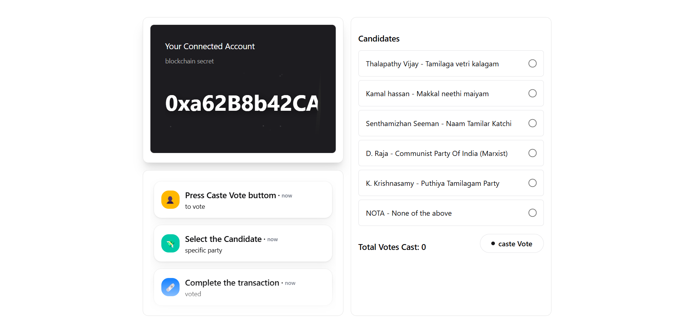

# 🗳️ Decentralized Voting System

A full-stack MERN-based decentralized voting platform integrated with Ethereum smart contracts. It enables tamper-proof voting with secure registration including facial recognition, Aadhaar, and OTP verification. Users vote through blockchain transactions using MetaMask, ensuring transparency and trust.

---

## 🧭 Project Userflow

Follow the journey of a user through the decentralized voting dApp:

### 1. 🏠 Homepage


---

### 2. 🔐 Authentication
#### ➕ Register


#### 🔑 Login


#### 📲 OTP Validation


---

### 3. 📊 Dashboard


---

### 4. 🗳️ Caste Vote Page


---

### 5. 🔍 Blockchain Identity Verification


---

### 6. 🦊 Metamask Confirmation


---

### 7. ✅ Vote Successful


## 🚀 Features

### 👨‍💼 Admin
- Add/manage elections and candidates.
- Distribute private keys to registered voters.

### 🧑‍💻 User Registration
- Register using Name, Mobile Number, Aadhaar Number, Voter ID, Face Capture, and Password.
- OTP verification for added security.

### 🗳️ Voting Process
- Access dashboard post OTP verification.
- Vote in active elections via MetaMask.
- On clicking "Vote", a decentralized blockchain transaction is triggered.
- Only one vote allowed per election per user (enforced by smart contracts).

---

## 📁 Project Structure

- `frontend` — Vite + React app for user interface
- `backend` — Node.js + Express API for handling data and logic
- `blockchain` — Ethereum smart contracts (Truffle framework)

---

## 🛠️ Installation & Setup

### 📦 Prerequisites

Ensure the following tools are installed:

- [Node.js](https://nodejs.org/)
- [npm](https://www.npmjs.com/)
- [nvm](https://github.com/nvm-sh/nvm) (optional but helpful)
- [MongoDB](https://www.mongodb.com/try/download/community)
- [MongoDB Compass](https://www.mongodb.com/products/compass) (optional)
- [Ganache](https://trufflesuite.com/ganache/)
- [MetaMask](https://metamask.io/)

---

### 🔗 Blockchain Setup

1. Navigate to the blockchain directory:

    ```bash
    cd blockchain
    ```

2. Compile the smart contracts:

    ```bash
    truffle compile
    ```

3. Migrate contracts to local blockchain:

    ```bash
    truffle migrate --reset
    ```

4. Start **Ganache** on `localhost:8545` and ensure your `truffle-config.js` is configured to use the same.

---

### 💻 Backend Setup

1. Navigate to the backend directory:

    ```bash
    cd backend
    ```

2. Install dependencies:

    ```bash
    npm install
    ```

3. Start the backend server:

    ```bash
    npm run dev
    ```

4. Backend runs on: `http://localhost:3000`

---

### 🌐 Frontend Setup

1. Navigate to the frontend directory:

    ```bash
    cd frontend
    ```

2. Install dependencies:

    ```bash
    npm install
    ```

3. Start the frontend app:

    ```bash
    npm run dev
    ```

4. Frontend runs on: `http://localhost:5173` (default Vite port)

---

### 🧪 MongoDB Setup

You can use either:

- **MongoDB Compass**
- **Local MongoDB Shell (`mongosh`)**

Default connection string:

```bash
mongodb://127.0.0.1:27017/

### 🔐 Environment Variables

#### 🌐 Frontend (`frontend/.env`)
```env
VITE_API_URL=http://localhost:5000/api
```

#### 🛡️ Backend (`backend/.env`)
```env
MONGO_URI=mongodb://127.0.0.1:27017/
JWT_SECRET=JWT_TOKEN
VOTING_CONTRACT_ADDRESS=your_deployed_contract_address
NODE_ENV=development
SESSION_SECRET=mySecret
EMAIL_SERVICE=gmail
EMAIL_USERNAME=your_mail@gmail.com
EMAIL_PASSWORD=your_email_password_or_app_passkey
```

---

### ✅ Final Notes

- ✅ Ensure **MetaMask** is connected to the local **Ganache blockchain** at `localhost:8545`.
- 🧪 Use **Ganache-provided private keys** for testing as **admin** and **users**.
- 🔒 Smart contract logic **prevents multiple votes** by the same user in one election.
- ⚙️ Make sure to **configure all environment variables** before starting the frontend and backend.

---

### 📬 Contact

For issues, suggestions, or contributions, feel free to **open an issue** or **submit a pull request**.

> 🛠️ Built with 💡 using **React**, **Node.js**, **MongoDB**, **Truffle**, and **Ethereum Blockchain**.

